# 구현 이해 가이드 — bourbon-agent-recommendation-api (Alpha)

이 문서는 지금까지(Phase 0–8A + 재설계된 8B 폴백 사다리 Track 1–4) 구현한 것을 **개념이 쌓이는 순서**로 정리한 것입니다.
빌드 순서(Phase 0→7)는 "계약을 먼저 얼리고 의존성 역순으로 짓는" 순서라서 처음 이해하기엔
거꾸로입니다. 아래는 "무엇을 왜 만드는가 → 무엇이 흐르는가 → 어떻게 처리하는가 →
어떻게 서빙/평가하는가" 순입니다.

각 섹션은 요약이고, `→ 자세히` 링크로 코드 레벨 deep-dive sub doc으로 들어갑니다.

> 위치 안내: 이 디렉터리(`Agent-Discovery-Planning/impl/`)는 planning repo의 추적 대상 문서입니다.
> 코드가 아니라 구현을 이해하기 위한 설계·해설 노트이며, 코드 repo가 아닌 planning repo에서 관리됩니다.

---

## 0. 이게 무엇을 하는 물건인가

**한 문장:** 유저가 "이 주제에 대해 물어볼/추천받을 사람(에이전트)"을 찾을 때, **주제에 대한
지식·전문성**을 근거로 개인 에이전트들을 랭킹해서 돌려주는 API입니다.

- 입력: `"주제 텍스트" + need_type` (예: `"양자컴퓨팅"` + `depth`)
- 출력: 랭크된 에이전트 목록 (`rank 1, 2, 3…` + 이유 문자열)

핵심 제약 3가지:
1. **지식/전문성만** 신호로 쓴다. companion·정서·일화 메모리는 후보 신호가 아니다.
2. **Alpha는 Pull 모드** (유저가 명시적으로 요청). Push(먼저 들이미는 것)는 Open Beta.
3. **scalar score가 없다.** 랭킹은 점수 합산이 아니라 **ordering contract** — "게이트 → 필터 →
   사전식 정렬 키 → tie-break" 규칙으로 순서만 정한다.

---

## 1. 멘탈 모델: 파이프라인 한 번의 호출

전부 `RecommendationPipeline.recommend(query)` 한 번의 호출로 흐릅니다
(`discovery/pipeline.py`). 7단계입니다:

```
ⓠ normalize → ① linker → ② retrieval → ③ gate → ④ ranking → ⑤ serving → ⑥ decision log
```

| 단계 | 모듈 | 하는 일 | 한 줄 요약 |
|---|---|---|---|
| ⓠ | `normalize.py` | query 문자열 정리 | 원시 요청 → 정규화된 need + stance |
| ① | `linker.py` | 주제 텍스트 → **QID 하나** | "양자컴퓨팅" → `Q28865` (grounding) |
| ② | `retrieval.py` | QID → 후보 에이전트들 | 직접 edge + sparse하면 이웃 한 홉 확장 |
| ③ | `gate.py` | need-무관 탈락 | eligibility/discoverable/maturity로 거른다 |
| ④ | `ranking.py` | need별 순서 + stance 필터 | 순서만 정함 (score 없음) |
| ⑤ | `serving.py` | 응답 payload + 침묵 판단 | top-N 잘라서 응답 만듦 |
| ⑥ | `decision_log.py` | 감사 기록 | 왜 이렇게 됐는지 전부 기록 |

파이프라인은 provider를 직접 안 들고 있습니다. 각 모듈이 생성 시점(composition root)에
provider를 주입받았고, 파이프라인은 도메인 모듈 5개만 조합합니다. 그래서 `eval/`을 절대
import하지 않고, 이게 import-isolation 테스트로 강제됩니다.

**두 개의 "0" 처리** (반복해서 나옵니다):
- **grounding 0**: linker가 QID를 못 찾음 → `GroundingFailedError` → 전파(422). 로그 row 없음.
- **agent pool 0**: grounding은 됐는데 후보가 0 → 에러 아님. 빈 목록 + `silence.silent=True`로
  200 응답, 로그 row는 남김 (침묵도 하나의 결정).

### 흐름도 (데이터 + 두 "0" + provider 주입)

```mermaid
flowchart TD
    Q["Query<br/>topic_text + need_type"] --> N["ⓠ normalize"]
    N -->|NormalizedQuery| L["① linker (grounding)"]
    L -->|"grounding 0"| E422(["GroundingFailedError → 422<br/>(로그 row 없음)"])
    L -->|"GroundingResult · QID"| R["② retrieval"]
    R -->|"list&#91;EdgeHit&#93;"| G["③ gate"]
    G -->|"survivors: list&#91;Candidate&#93;"| RK["④ ranking"]
    RK -->|"ranked (+ filter_dropped)"| SV["⑤ serving"]
    SV -->|"top-limit items<br/>또는 pool 0 → silent 200"| REC(["Recommendation"])

    G -. dropped .-> DL["⑥ decision log"]
    L -. grounding trace .-> DL
    RK -. full ranking .-> DL
    SV -. serving verdict .-> DL
    REC -. decision_log_id stamp .-> DL

    KP[("KnowledgeEntityProvider<br/>(real HTTP / anchored)")] -. inject .-> L
    KP -. inject .-> R
    EP[("MemoryEdgeProvider · mock")] -. inject .-> R
    ELP[("EligibilityProvider · mock")] -. inject .-> G
    PP[("PersonaProvider · mock")] -. inject .-> G
```



> 실선 = 파이프라인 데이터 흐름, 점선 = 감사 기록 수집 + provider 주입. 두 "0"이 갈리는 지점:
> linker에서 `422`(row 없음), serving에서 `silent 200`(row 있음). provider는 파이프라인이 아니라
> [composition root](07-composition-api-cli.md)가 각 모듈에 주입 — 그래서 real↔mock이 배선만으로
> 교체됩니다.

### 타입 변형 요약

```
Query ──normalize──▶ NormalizedQuery ──linker──▶ GroundingResult(QID)
      ──retrieval──▶ list[EdgeHit] ──gate──▶ list[Candidate] (survivors/dropped)
      ──ranking──▶ 정렬된 list[Candidate] ──serving──▶ Recommendation
```

`Candidate`는 ②에서 태어나(EdgeHit+eligibility) ④까지 in-place로 살이 붙고(features/ordering_keys/
stance/drop_reason), ⑥에서 감사 row로 굳습니다.

---

## 2. 무엇이 흐르는가 — 핵심 데이터 계약

파이프라인 사이로 흐르는 자료구조(`discovery/structs/`)를 먼저 알아야 합니다.

- 세 개의 I/O 경계: `Query`(요청) / `NormalizedQuery`(파이프라인 입력) / `Recommendation`(응답)
- **`AgentTopicEdge`** — 시스템의 심장. "에이전트가 한 주제에 대해 무엇을 아는가"를 QID에 앵커링.
- **`Candidate`** — 모듈 ②→④를 관통하는 내부 객체. **scalar score 필드가 의도적으로 없음.**

**→ 자세히: [01. 데이터 계약](01-data-contracts.md)**

---

## 3. Provider 경계 — 진짜/가짜가 갈리는 이음매

**4개의 Protocol**(`providers/base.py`)이 Discovery와 데이터 소스 사이의 seam입니다. real
구현(HTTP)과 mock이 *같은* Protocol을 구현하므로, real↔mock 교체가 코드 변경이 아니라 **배선**.
이게 "mock-first / contract-first" 전략의 뼈대입니다.

**→ 자세히: [02. Provider 경계](02-provider-boundary.md)**

---

## 4. 파이프라인 단계 상세

각 단계가 코드에서 어떻게 생겼는지, 비자명한 결정의 "왜"까지. 먼저 **[00. 파이프라인 I/O
참조](00-pipeline-io-reference.md)** 가 전 단계를 **INPUT → 처리 → OUTPUT** 한 틀로 요약합니다(shape/흐름
관점, ① linker는 rung별로 분해). 그다음 아래 서술형 deep-dive에서 "왜"를 봅니다:

- **[03. normalize + linker (grounding)](03-normalize-and-linker.md)** — ⓠ 문자열 파싱 + ①
  기호적 label 매칭으로 QID 확정, adoption gate(confidence/margin).
- **[04. retrieval](04-retrieval.md)** — ② direct edge + sparse 판정 + one-hop 확장 + direct-wins.
- **[05. gate + ranking](05-gate-and-ranking.md)** — ③ need-무관 탈락 vs ④ need-의존 순서
  (for/against 상대 stance, coverage round-robin, experience).
- **[06. serving + decision log](06-serving-and-decision-log.md)** — ⑤ payload/침묵 + ⑥ 감사 기록.

---

## 5. 어떻게 서빙되는가 — composition root + API/CLI

파이프라인은 모듈만 조합하고, provider 배선은 **composition root**에서 합니다. FastAPI
`POST /recommend`, lifespan에서 client 1회 생성, 도메인 에러 → HTTP 매핑은 API layer 전용.

**→ 자세히: [07. composition + API + CLI](07-composition-api-cli.md)**

---

## 6. LLM 레이어 — rerank leg는 라이브(Phase 8A), expansion·substitution은 실렸으나 잠듦

memory-api `memory/llm`에서 structured-completion spine만 포팅. proxy default, direct는 비활성.
grounding은 기본 기호적 매칭이지만, gate가 애매해서 실패하면 **LLM rerank fallback②**(Phase 8A)이
serving에서 돎 — e3llm-api proxy 경유, keyless Gemini 기본. 재설계된 8B 폴백 사다리의
**expansion③ + substitution④는 opt-in으로 실렸으나 기본 OFF로 잠듦**(composition root 전용,
eval 미진입 → baseline.json 바이트 불변, 주입된 report-only 스트라텀에서만 측정). free-form stance
normalizer(8-3)·rich per-need reason generator(8-5)도 같은 dormant-ship으로 착지(기본 OFF). 아직 안 지은
것은 B2 judge(8-4)·Open-Beta gate 필드(8-6)·grounding context(8-7)뿐.

**→ 자세히: [08. LLM 레이어](08-llm-layer.md)**

---

## 7. 평가 시스템 — 이 프로젝트의 절반

`eval/`은 **두 레이어**로 갈립니다:

- **[09. eval harness (Phase 6)](09-eval-harness.md)** — 실행/커버리지. 커밋된 코퍼스를 실제
  파이프라인에 재생. **점수 없음(score-free).**
- **[10. eval metrics + gates (Phase 7)](10-eval-metrics-and-gates.md)** — 채점. gold/baseline에
  대해 hard gate + ratchet. **결정적 gold — LLM judge 없음.**

---

## 8. 앞으로 — 남은 미구현 (8-4/8-6/8-7 + Phase 10)

8B 폴백 사다리(rerank②→expansion③→substitution④→silence)·**Phase 9 (eval→CI 게이트)**·자유형 stance
정규화(8-3)·풍부한 per-need reason(8-5)은 이제 구현됨. 남은 미구현은 LLM 품질 슬라이스(8-4 B2 silver
judge / 8-6 Open-Beta gate fields / 8-7 grounding context) + **Phase 10 (real edge 통합 = user-facing
Alpha 성립의 마지막 조각)**. 합의된 다음 순서는 **Phase 10 → 8B 잔여 튜닝**(expansion threshold/stratum).
**2026-07-14:** memory-api가 다국어 인덱스 fix + `context=`/`types=` 검색을 배포 → cross-language recall
해소 + context 기반 sense 선택 경로 열림. 이로써 §8-7 재구성(importance tiebreak 폐기 → context-반영 backend
순서로 **linker 채택 계약 변경**)·real-anchor 재측정 = GROUND 7 / TIE 10 / MISS 3(실패 원인이 recall→
tiebreak로 이동). 기존 코드/계약이 어떻게 바뀔지:

**→ [11. Forward 로드맵](11-phase-8-9-roadmap.md)**

---

## 부록: 용어 규범 (glossary lock)

문서·코드·메모리가 다시 어긋나지 않도록 grounding/linker/response/log/CI 전반의 canonical 용어를
여기 한곳에 고정한다. 다른 impl/ 문서(예: [10. eval](10-eval-metrics-and-gates.md))는 이 glossary를 따른다.

- **canonical grounding 사다리:** `symbolic → rerank → expansion → best_effort_substitution → silence`
  (정밀 코어 → 폴백 rung ②③④ → 침묵). enum 원본은 `discovery/structs/grounding.py`의
  `GroundingMode = Literal["symbolic", "rerank", "expansion", "best_effort_substitution"]`.
- **method vs mode:** 내부/로그는 `GroundingResult.method`, 응답 view는 `grounding.mode` (둘은 **같은
  enum 값**). **top-level `grounding_mode` 필드는 없다.**
- **expansion vs substitution:** expansion③ = *같은* 주제를 다른 검색어로 회복(LLM은 검색어만 제안,
  최종 QID는 재검색+gate가 결정). substitution④ = *관련* 주제로의 대체이며 **반드시**
  `substitute_anchor_qid` + 비어있지 않은 `substitution_reason`을 동반한 *신호된* swap.
- **proxy:** 오직 LLM **transport**(`discovery.llm.proxy` gateway)만 가리킨다 — grounding rung 이름이 아니다.
- **"Phase 8B 완료"의 정확한 의미:** fallback ladder *mechanics* implemented · rerank **live**(8A) ·
  expansion·substitution **shipped dormant**(default OFF) · memory-api relevance fix 후 **tuning pending**.
  "8B 완료"만 쓰면 오해되므로 위 4단으로 표기한다.
- **금지/stale 표현:** `best_effort_proxy`, `proxy_reason`, `proxy_anchor_qid`, top-level `grounding_mode`,
  "full listwise replacement"(구 8B 원안, 폐기됨), "expansion이 QID를 고른다"(expansion은 검색어만 제안),
  "CI가 품질을 증명한다"(CI = 회귀 tripwire). gate/ratchet 문맥의 "teeth"도 → regression signal / coverage로.
  단 substrate-hardness 문맥의 **"real anchor = teeth"** 는 별개 개념으로 유지한다.

---

## 부록: 빌드 순서 vs 이해 순서

| 이해 순서 (이 문서) | 빌드 순서 (실제 Phase) | 왜 다른가 |
|---|---|---|
| 데이터 계약 (§2) | Phase 1 (계약 동결) | 계약을 **먼저** 얼려야 mock/real이 합의 가능 |
| provider 경계 (§3) | Phase 1–2 | seam이 mock-first의 뼈대 |
| 파이프라인 단계 (§4) | Phase 4 | 계약·provider가 있어야 조립 가능 |
| 서빙/API (§5) | Phase 5 | 도메인이 완성돼야 배선 |
| 평가 (§7) | Phase 3(mock), 6, 7 | 파이프라인이 있어야 평가 대상 존재 |

빌드는 "계약을 얼리고(1) → real 앵커 붙이고(2) → mock/코퍼스(3) → 파이프라인(4) → 서빙(5) →
평가 코퍼스(6) → 게이트(7)" 순서로, **의존성이 낮은 계약부터 얼려서 흔들림을 줄이는** 전략이었습니다.
