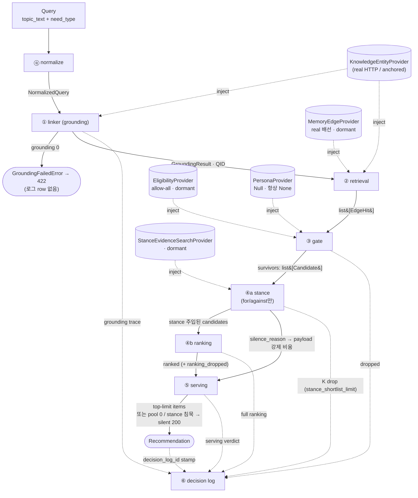

# 구현 이해 가이드 — bourbon-agent-recommendation-api (Alpha)

이 문서는 지금까지(Phase 0–8A + 재설계된 8B 폴백 사다리 Track 1–4 + 8-5/8-7·stance ④a·Phase 10 real edge slice) 구현한 것을 **개념이 쌓이는 순서**로 정리한 것입니다.
빌드 순서(Phase 0→7)는 "계약을 먼저 얼리고 의존성 역순으로 짓는" 순서라서 처음 이해하기엔
거꾸로입니다. 아래는 "무엇을 왜 만드는가 → 무엇이 흐르는가 → 어떻게 처리하는가 →
어떻게 서빙/평가하는가" 순입니다.

각 섹션은 요약이고, `→ 자세히` 링크로 코드 레벨 deep-dive sub doc으로 들어갑니다.

> 위치 안내: 이 디렉터리(`Agent-Discovery-Planning/impl/`)는 planning repo의 추적 대상 문서입니다.
> 코드가 아니라 구현을 이해하기 위한 설계·해설 노트이며, 코드 repo가 아닌 planning repo에서 관리됩니다.

---

## 0. 이게 무엇을 하는 물건인가

**한 문장:** 유저가 "이 주제에 대해 물어볼/추천받을 사람(에이전트)"을 찾을 때, **주제에 대한
지식·전문성**을 근거로 개인 에이전트들을 랭킹해서 돌려주는 API입니다.

- 입력: `"주제 텍스트" + need_type` (예: `"양자컴퓨팅"` + `depth`)
- 출력: 랭크된 에이전트 목록 (`rank 1, 2, 3…` + 이유 문자열)

핵심 제약 3가지:
1. **지식/전문성만** 신호로 쓴다. companion·정서·일화 메모리는 후보 신호가 아니다.
2. **Alpha는 Pull 모드** (유저가 명시적으로 요청). Push(먼저 들이미는 것)는 Open Beta.
3. **scalar score가 없다.** 랭킹은 점수 합산이 아니라 **ordering contract** — "게이트 → 필터 →
   사전식 정렬 키 → tie-break" 규칙으로 순서만 정한다.

---

## 1. 멘탈 모델: 파이프라인 한 번의 호출

전부 `RecommendationPipeline.recommend(query)` 한 번의 호출로 흐릅니다
(`discovery/pipeline.py`). 8단계이고, 그중 ④a만 need에 따라 조건부입니다:

```
ⓠ normalize → ① linker → ② retrieval → ③ gate → [④a stance] → ④b ranking → ⑤ serving → ⑥ decision log
```

| 단계 | 모듈 | 하는 일 | 한 줄 요약 |
|---|---|---|---|
| ⓠ | `normalize.py` | 요청 검증 + 맥락 투영 | proposition 존재 검증(for/against), 대화 맥락 lean 투영 |
| ① | `linker.py` | 주제 텍스트 → **QID 하나** | "양자컴퓨팅" → `Q28865` (grounding) |
| ② | `retrieval.py` | QID → 후보 에이전트들 | 직접 edge + sparse하면 이웃 한 홉 확장 |
| ③ | `gate.py` | need-무관 탈락 | eligibility/discoverable/maturity로 거른다 |
| ④a | `stance.py` | **for/against만** — 입장 판정 | 근거 검색 → judge → 후보에 query-time stance 주입 |
| ④b | `ranking.py` | need별 순서 + stance 필터 | 순서만 정함 (score 없음) |
| ⑤ | `serving.py` | 응답 payload + 침묵 판단 | top-N 잘라서 응답 만듦 |
| ⑥ | `decision_log.py` | 감사 기록 | 왜 이렇게 됐는지 전부 기록 |

파이프라인은 provider를 직접 안 들고 있습니다. 각 모듈이 생성 시점(composition root)에
provider를 주입받았고, 파이프라인은 도메인 모듈 5개 + optional seam 2개(stance evaluator·reason
generator)만 조합합니다. 그래서 `eval/`을 절대 import하지 않고, 이게 import-isolation 테스트로
강제됩니다.

**두 개의 "0" 처리** (반복해서 나옵니다):
- **grounding 0**: linker가 QID를 못 찾음 → `GroundingFailedError` → 전파(422). 로그 row 없음.
- **agent pool 0**: grounding은 됐는데 후보가 0 → 에러 아님. 빈 목록 + `silence.silent=True`로
  200 응답, 로그 row는 남김 (침묵도 하나의 결정).

### 흐름도 (데이터 + 두 "0" + provider 주입)


```mermaid
flowchart TD
    Q["Query<br/>topic_text + need_type"] --> N["ⓠ normalize"]
    N -->|NormalizedQuery| L["① linker (grounding)"]
    L -->|"grounding 0"| E422(["GroundingFailedError → 422<br/>(로그 row 없음)"])
    L -->|"GroundingResult · QID"| R["② retrieval"]
    R -->|"list&#91;EdgeHit&#93;"| G["③ gate"]
    G -->|"survivors: list&#91;Candidate&#93;"| ST["④a stance<br/>(for/against만)"]
    ST -->|"stance 주입된 candidates"| RK["④b ranking"]
    ST -->|"silence_reason → payload 강제 비움"| SV
    RK -->|"ranked (+ ranking_dropped)"| SV["⑤ serving"]
    SV -->|"top-limit items<br/>또는 pool 0 / stance 침묵 → silent 200"| REC(["Recommendation"])

    G -. dropped .-> DL["⑥ decision log"]
    L -. grounding trace .-> DL
    ST -. "K drop (stance_shortlist_limit)" .-> DL
    RK -. full ranking .-> DL
    SV -. serving verdict .-> DL
    REC -. decision_log_id stamp .-> DL

    KP[("KnowledgeEntityProvider<br/>(real HTTP / anchored)")] -. inject .-> L
    KP -. inject .-> R
    EP[("MemoryEdgeProvider<br/>real 배선 · dormant")] -. inject .-> R
    ELP[("EligibilityProvider<br/>allow-all · dormant")] -. inject .-> G
    PP[("PersonaProvider<br/>Null · 항상 None")] -. inject .-> G
    SP[("StanceEvidenceSearchProvider<br/>· dormant")] -. inject .-> ST
```

> 실선 = 파이프라인 데이터 흐름, 점선 = 감사 기록 수집 + provider 주입. 두 "0"이 갈리는 지점:
> linker에서 `422`(row 없음), serving에서 `silent 200`(row 있음). provider는 파이프라인이 아니라
> [composition root](07-composition-api-cli.md)가 각 모듈에 주입 — 그래서 real↔mock이 배선만으로
> 교체됩니다.

### 타입 변형 요약

```
Query ──normalize──▶ NormalizedQuery ──linker──▶ GroundingResult(QID)
      ──retrieval──▶ list[EdgeHit] ──gate──▶ list[Candidate] (survivors/dropped)
      ──stance(④a)──▶ StanceEvaluation(candidates, silence_reason)   # for/against만
      ──ranking──▶ 정렬된 list[Candidate] ──serving──▶ Recommendation
```

`Candidate`는 ③ Gate에서 태어나(EdgeHit + eligibility + persona) ④b까지 in-place로 살이
붙고(features/ordering_keys/stance/drop_reason), ⑥에서 감사 row로 굳습니다. ④a가 채우는 stance 3필드는 **edge에서 복사한 게 아니라
요청 시점에 판정된 값**입니다.

---

## 2. 무엇이 흐르는가 — 핵심 데이터 계약

파이프라인 사이로 흐르는 자료구조(`discovery/structs/`)를 먼저 알아야 합니다.

- 세 개의 I/O 경계: `Query`(요청) / `NormalizedQuery`(파이프라인 입력) / `Recommendation`(응답)
- **`AgentTopicEdge`** — 시스템의 심장. "에이전트가 한 주제에 대해 무엇을 아는가"를 QID에 앵커링.
- **`Candidate`** — ③에서 태어나 ④b까지 관통하는 내부 객체. **scalar score 필드가 의도적으로 없음.**

**→ 자세히: [01. 데이터 계약](01-data-contracts.md)**

---

## 3. Provider 경계 — 진짜/가짜가 갈리는 이음매

**5개의 Protocol**(`providers/base.py`)이 Discovery와 데이터 소스 사이의 seam입니다. real
구현(HTTP)과 mock이 *같은* Protocol을 구현하므로, real↔mock 교체가 코드 변경이 아니라 **배선**.
이게 "mock-first / contract-first" 전략의 뼈대입니다. 다섯 번째인
`StanceEvidenceSearchProvider`(④a용)는 앞의 넷과 degradation 정책이 달라서 — 실패가 503도 빈 결과도
아니고 **사유 붙은 침묵** — 별도로 읽을 값어치가 있습니다.

**→ 자세히: [02. Provider 경계](02-provider-boundary.md)**

---

## 4. 파이프라인 단계 상세

각 단계가 코드에서 어떻게 생겼는지, 비자명한 결정의 "왜"까지. 먼저 **[00. 파이프라인 I/O
참조](00-pipeline-io-reference.md)** 가 전 단계를 **INPUT → 처리 → OUTPUT** 한 틀로 요약합니다(shape/흐름
관점, ① linker는 rung별로 분해). 그다음 아래 서술형 deep-dive에서 "왜"를 봅니다:

- **[03. normalize + linker (grounding)](03-normalize-and-linker.md)** — ⓠ proposition 검증·
  canonicalization + 대화 맥락 투영, ① 기호적 label 매칭으로 QID 확정, adoption gate(confidence/margin).
- **[04. retrieval](04-retrieval.md)** — ② direct edge + sparse 판정 + one-hop 확장 + direct-wins.
- **[05. gate + stance + ranking](05-gate-and-ranking.md)** — ③ need-무관 탈락 vs ④a query-time 입장
  판정 vs ④b need-의존 순서 (for/against 절대 position, coverage round-robin, experience).
- **[06. serving + decision log](06-serving-and-decision-log.md)** — ⑤ payload/침묵 + ⑥ 감사 기록.
- **[12. agent recommendation algorithm](12-agent-recommendation-algorithm.md)** — 제품 관점: 현재 topic-expertise 축 + 이후 personalization/social 축(future). 파이프라인 단계 위의 알고리즘 레이어링.

---

## 5. 어떻게 서빙되는가 — composition root + API/CLI

파이프라인은 모듈만 조합하고, provider 배선은 **composition root**에서 합니다. 소유는 두 층으로 갈립니다 —
**lifespan이 httpx pool을 가진 client 3개를 만들고 닫고**, `build_pipeline`은 받은 것을 배선만 하는
**client 비소유 조립기**입니다(조립이 실패해도 자기가 소유한 적 없는 자원을 샐 수 없음). FastAPI `POST /recommend`,
도메인 에러 → HTTP 매핑(422 둘 · 503 셋)은 API layer 전용. 그 조립기에 **두 번째 호출자**가 있습니다 —
real memory-api 코퍼스를 상대로 같은 그래프를 돌리는 진단 CLI `e2e-recommend`(2026-07-29).

**→ 자세히: [07. composition + API + CLI](07-composition-api-cli.md)**

---

## 6. LLM 레이어 — rerank leg는 라이브(Phase 8A), expansion·substitution은 실렸으나 잠듦

memory-api `memory/llm`에서 structured-completion spine만 포팅. proxy default, direct는 비활성.
grounding은 기본 기호적 매칭이지만, gate가 애매해서 실패하면 **LLM rerank fallback②**(Phase 8A)이
serving에서 돎 — e3llm-api proxy 경유, keyless Gemini 기본. 재설계된 8B 폴백 사다리의
**expansion③ + substitution④는 opt-in으로 실렸으나 기본 OFF로 잠듦**(composition root 전용,
eval 미진입 → baseline.json 바이트 불변, 주입된 report-only 스트라텀에서만 측정). rich per-need reason
generator(8-5)도 같은 dormant-ship으로 착지(기본 OFF). **agentic grounder(8-7, 동음이의 disambiguation)** 도
같은 방식으로 착지 — context 있을 때 primary가 되고 켜지면 위 사다리를 대체(기본 OFF, online 게이트는 8-4
judge). **for/against의 stance query generator + judge(④a)** 도 dormant-ship(`STANCE_JUDGE_ENABLED` 기본
OFF) — 꺼지면 for/against는 몰래 열화되지 않고 `stance_judge_disabled`로 **침묵**합니다. 아직 안 지은 것은
B2 judge(8-4)·Open-Beta gate 필드(8-6)뿐.

**→ 자세히: [08. LLM 레이어](08-llm-layer.md)**

---

## 7. 평가 시스템 — 이 프로젝트의 절반

`eval/`은 **두 레이어**로 갈립니다:

- **[09. eval harness (Phase 6)](09-eval-harness.md)** — 실행/커버리지. 커밋된 코퍼스를 실제
  파이프라인에 재생. **점수 없음(score-free).**
- **[10. eval metrics + gates (Phase 7)](10-eval-metrics-and-gates.md)** — 채점. gold/baseline에
  대해 hard gate + ratchet. **결정적 gold — LLM judge 없음.**

---

## 8. 앞으로 — 남은 미구현 (8-4/8-6 + Phase 10 turn-on)

8B 폴백 사다리(rerank②→expansion③→substitution④→silence)·**Phase 9 (eval→CI 게이트)**·풍부한 per-need
reason(8-5)·**agentic grounder 재설계(8-7, 기본 OFF)**·**query-time stance 판정(④a, 기본 OFF)**는 이제
구현됨(구 자유형 stance 정규화 8-3은 구현됐다가 요청 모델 재설계와 함께 **제거**). 남은
미구현은 LLM 품질 슬라이스(8-4 B2 silver judge / 8-6 Open-Beta gate fields)와 **Phase 10의 production
turn-on**입니다. Phase 10의 **edge projection·composition 배선은 완료**돼 `REAL_EDGE_ENABLED` 뒤에
실려 있고 — 코드 기본은 OFF지만 **dev overlay가 ON으로 설정**(measurement activation), production stage는
startup에서 거부 — 남은 것은
**추가 배선이 아니라 promotion 게이트 4개를 닫는 구현·계약 작업**입니다(requester self-exclusion 구현 ·
producer-side derivation pin + 테스트 · phantom agent 검증·정책 · memory-api R1–R6 구현·검증).
합의된 다음 순서는 **Phase 10 turn-on → 8B 잔여 튜닝**(expansion threshold/stratum). **8-7의 online 활성화 게이트는 8-4 judge**(context grounding 품질은 결정적 gold로 보증 불가).
**2026-07-15:** 동음이의 disambiguation은 memory-api 검색 `context=`(이후 제거됨)가 아니라 **대화 맥락을 읽는
agentic grounder**로 확정 — 구 §8-7 "C-lite backend 검색 → linker 채택계약 변경" 계획은 폐기(그 이전 real-anchor
재측정 GROUND 7 / TIE 10 / MISS 3에서 실패 원인이 recall→tiebreak로 이동한 것이 재설계의 배경). 기존 코드/계약이
어떻게 바뀔지:

**→ [11. Forward 로드맵](11-forward-roadmap.md)**

---

## 부록: 용어 규범 (glossary lock)

문서·코드·메모리가 다시 어긋나지 않도록 grounding/linker/stance/edge/response/log/CI 전반의 canonical
용어를 여기 한곳에 고정한다. 다른 impl/ 문서(예: [10. eval](10-eval-metrics-and-gates.md))는 이 glossary를
따른다.

> **적용 범위:** 아래 금지 항목은 **현행 계약을 서술할 때** 금지다. **이력 인용은 허용**하되 폐기·대체
> 사실을 함께 표시한다(취소선 + 사유, "구 …는 폐기", "당시 후보 매핑" 같은 superseded 표기). 폐기 기록을
> 지우면 "왜 코드에 없지?"로 같은 조사를 반복하게 되므로, **지우지 말고 표시하라**는 쪽이 규범이다.

- **canonical grounding 사다리:** `symbolic → rerank → expansion → best_effort_substitution → silence`
  (정밀 코어 → 폴백 rung ②③④ → 침묵). enum 원본은 `discovery/structs/grounding.py`의
  `GroundingMode = Literal["symbolic", "rerank", "expansion", "best_effort_substitution"]`.
- **method vs mode:** 내부/로그는 `GroundingResult.method`, 응답 view는 `grounding.mode` (둘은 **같은
  enum 값**). **top-level `grounding_mode` 필드는 없다.**
- **expansion vs substitution:** expansion③ = *같은* 주제를 다른 검색어로 회복(LLM은 검색어만 제안,
  최종 QID는 재검색+gate가 결정). substitution④ = *관련* 주제로의 대체이며 **반드시**
  `substitute_anchor_qid` + 비어있지 않은 `substitution_reason`을 동반한 *신호된* swap.
- **proxy:** 오직 LLM **transport**(`discovery.llm.proxy` gateway)만 가리킨다 — grounding rung 이름이 아니다.
- **"Phase 8B 완료"의 정확한 의미:** fallback ladder *mechanics* implemented · rerank **live**(8A) ·
  expansion·substitution **shipped dormant**(default OFF) · memory-api relevance fix 후 **tuning pending**.
  "8B 완료"만 쓰면 오해되므로 위 4단으로 표기한다.
- **은퇴한 stance 어휘 → 현재 대체어** (stance 재설계로 은퇴·대체 — 앞의 넷은 요청 모델 변경, 뒤의 둘은
  ranking/log 계약 변경):

  | 은퇴 | 현재 |
  |---|---|
  | `user_stance_ref` (요청 필드) | `proposition` — 판단 대상 주장 문장 |
  | 문법 `"axis=…; dir=…; text=…"` | 문법 없음 (자유 문장, strip만) |
  | `UserStanceRef{axis, dir, text, confidence}` | 없음 — 후보 쪽 `StancePosition` |
  | drop 사유 `off_axis` | `stance_unevaluated` |
  | "stance normalizer" (Phase 8-3) | 없음 — LLM은 ⓠ가 아니라 ④a(query generator + judge) |
  | `need_filter="same_axis_required_stance"` | `"need_type_required_position"` |

- **stance 타입 셋은 서로 다른 것이다** (섞으면 계약이 무너진다 · 상세 = [01](01-data-contracts.md)):
  `Stance`(edge의 memory 소유 관측값) / `StanceVerdictLabel`(judge 출력, `insufficient` 포함) /
  `StancePosition`(`Candidate`·`StanceView`가 나르는 **two-value 절대 입장**; `insufficient`는 저장되지
  않는다 — 그래서 judge 출력과 저장 타입이 **일부러 다른 enum**이다). `stance_position`을 가졌다고 서빙되는
  것은 아니다: 반대 입장(`wrong_stance`)이나 낮은 confidence로 탈락한 후보도 이 값을 들고 로그에 남는다.
- **"axis 폐기"의 정확한 범위:** 폐기된 것은 **production Ranker의 axis 비교 단계와 `off_axis` drop 사유**
  뿐이다. `stance_axis` 필드는 frozen edge 계약과 eval 코퍼스에 **남아 있고** 결정적 eval mirror가 쓴다.
  "axis 개념 자체가 폐기됐다"는 금지 ([05](05-gate-and-ranking.md)).
- **"real edge 통합에 파이프라인 변경 없음"의 정확한 범위:** 계약과 owner-space routing이 **먼저 정렬된
  뒤** lifespan turn-on 배선이 discovery 파이프라인 변경 없이 끝났다는 뜻이다. 선행 정렬 자체는 파이프라인을
  바꿨다(`memory_owner_id` · `_evidence_key`). "real edge 통합 전체가 무변경"은 금지
  ([02](02-provider-boundary.md)).
- **provider 호출 1회 ≠ HTTP 요청 1회:** ④a evaluator는 `StanceEvidenceSearchProvider.search()`를 정확히
  한 번 부르지만, HTTP 어댑터는 owner chunk별로 여러 POST를 낸다. 비용·부하를 말할 때 둘을 구분한다
  ([00 ④a 절](00-pipeline-io-reference.md)).
- **"Phase 10 완료"의 정확한 의미:** edge **projection·composition 배선**은 완료 · `REAL_EDGE_ENABLED`
  기본 OFF **dormant** · production stage는 startup 거부 · 남은 것은 **promotion 게이트 4개이며 넷 다
  구현·테스트 또는 upstream 계약 착지를 요구**한다(B1도 bourbon-api에 namespace/vector pin 테스트와
  immutable 선언을 착지시키는 작업이다). "Phase 10 완료"만 쓰면 오해되므로 위 4단으로 표기한다
  ([11](11-forward-roadmap.md)).
- **금지/stale 표현:** `best_effort_proxy`, `proxy_reason`, `proxy_anchor_qid`, top-level `grounding_mode`,
  "full listwise replacement"(구 8B 원안, 폐기됨), "expansion이 QID를 고른다"(expansion은 검색어만 제안),
  "CI가 품질을 증명한다"(CI = 회귀 tripwire). gate/ratchet 문맥의 "teeth"도 → regression signal / coverage로.
  단 substrate-hardness 문맥의 **"real anchor = teeth"** 는 별개 개념으로 유지한다.
  여기에 위 stance/edge 항목이 더해진다: 은퇴 어휘 6개 · "axis 개념 폐기" · "real edge 무변경" ·
  "검색 1콜"(HTTP 수와 혼동) · `/personal/groundings/{qid}`와 `GroundingMatch`(**존재한 적 없는** 라우트/
  타입 — 실제는 `GET /{prefix}/personal/entities/{qid}`에 `owner_id` 생략).

---

## 부록: 빌드 순서 vs 이해 순서

| 이해 순서 (이 문서) | 빌드 순서 (실제 Phase) | 왜 다른가 |
|---|---|---|
| 데이터 계약 (§2) | Phase 1 (계약 동결) | 계약을 **먼저** 얼려야 mock/real이 합의 가능 |
| provider 경계 (§3) | Phase 1–2 | seam이 mock-first의 뼈대 |
| 파이프라인 단계 (§4) | Phase 4 | 계약·provider가 있어야 조립 가능 |
| 서빙/API (§5) | Phase 5 | 도메인이 완성돼야 배선 |
| 평가 (§7) | Phase 3(mock), 6, 7 | 파이프라인이 있어야 평가 대상 존재 |

빌드는 "계약을 얼리고(1) → real 앵커 붙이고(2) → mock/코퍼스(3) → 파이프라인(4) → 서빙(5) →
평가 코퍼스(6) → 게이트(7)" 순서로, **의존성이 낮은 계약부터 얼려서 흔들림을 줄이는** 전략이었습니다.
